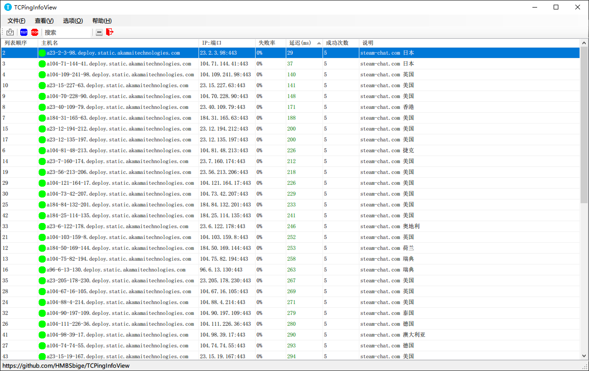

# TCPingInfoView

[](https://github.com/HMBSbige/TCPingInfoView/blob/master/LICENSE)

[](https://store.steampowered.com/app/828090)
[](https://ci.appveyor.com/project/HMBSbige/tcpinginfoview/branch/steam)
[](https://store.steampowered.com/app/828090)

[](https://github.com/HMBSbige/TCPingInfoView/releases)
[](https://ci.appveyor.com/project/HMBSbige/tcpinginfoview/branch/master)
[](https://github.com/HMBSbige/TCPingInfoView/releases)

**建议运行环境**
* Windows 10 1703 或以上
* Microsoft.NET Framework 4.7.1 或以上

可能兼容 Microsoft.NET Framework 4（未测试）

# [Steam 上购买](https://store.steampowered.com/app/828090)

## 这是做什么的
用来测试 TCP 连接延迟、监视你的网络服务是否正常的简单工具

~~而我是用来监视我的 [ASF](https://github.com/JustArchiNET/ArchiSteamFarm)、游戏服务器和 NAS 的~~

## 截图


## TXT列表格式举例
```
www.youtube.com:80 YouTube 80端口 注释可包括空格
www.google.com 谷歌，默认443端口
```

## 应该支持
* 高 DPI
* 兼容 Win7


## 尚未完成
* 内置简单编辑器
* 可设置高延迟上限
* 设置数据上限